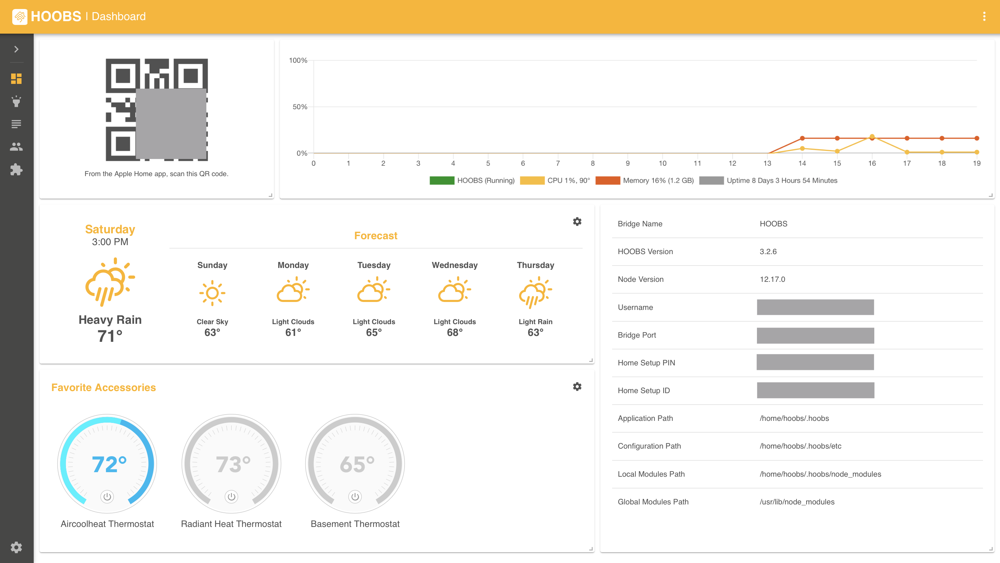

# Hoobs Smart Home Configuration

My Configuration for using Hoobs for Homebridge. Including Plugins I use with confidential info replaced. The replaced strings look like this: !APIKEY!

- [Hoobs](https://hoobs.org)
- [Homebridge](https://homebridge.io)

---

### Plugins
- [Tuya App](#Tuya)
- [Google Nest](#Google-Nest)
- [LG WebOS TV](#LG-WebOS-TV)
- [Rachio Platform](#Rachio-Platform)

---
### Tuya
[homebridge-tuya-app](https://github.com/basdelfos/homebridge-tuya-web#readme)

There are a few apps that are used in the Tuya platform, I have an account with SmartLife so I chose to use this along with its Username and Password for setup.

---
### Google Nest
[homebridge-google-nest](https://github.com/ryanleesmith/homebridge-google-nest)

You will need to get some google authentication to use the API. If you login to your nest account in chrome and do some tricks you can find your "issuetokens", "cookies" and "apikey". Both the issuetokens and cookies are extremely long strings.

---
### LG WebOS TV
[homebridge-lgwebos-tv](https://github.com/grzegorz914/homebridge-lgwebos-tv#readme)

To configure this I went to the network setttings on my TV to find the local IP Address and Mac Address to configure.

---
### Rachio Platform
[homebridge-rachio-platform](https://github.com/kcharwood/homebridge-rachio-platform#readme)

You will need the API Key from Rachio. This is pretty straight forward if you follow the documentation. You just have to go to your settings on the Rachio web app.

---

### Things to Note

#### Server
Hoobs is being run on an Ubuntu Linux Server.

#### Server Port
I am using "7070" as port when "8080" is the default. I am using another application on my server that runs on 8080 so I decided to change Hoobs so they do not interfere.

#### Polling Intervals
I set my polling interval (the amount of time between checking to see if something is on or off) to a couple of minutes because I plan to only use homekit to turn the devices on and off. If I was going to continue to use the native apps then I would want to set this somewhere between 10-30sec.
